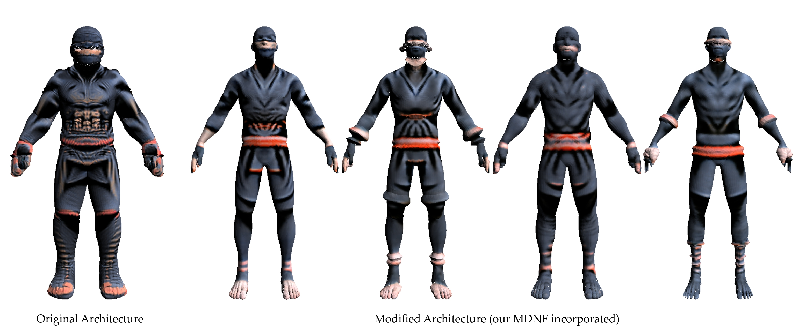

## MDNF: Multi-Diffusion-Nets for Neural Fields on Meshes<br>

Avigail Cohen Rimon, Tal Shnitzer, Mirela Ben Chen
<br>https://onlinelibrary.wiley.com/doi/pdf/10.1111/cgf.70188<br>

Abstract: *We propose a novel framework for representing neural fields on triangle meshes that is multi-resolution across both spatial
and frequency domains. Inspired by the Neural Fourier Filter Bank (NFFB), our architecture decomposes the spatial and
frequency domains by associating finer spatial resolution levels with higher frequency bands, while coarser resolutions are
mapped to lower frequencies. To achieve geometry-aware spatial decomposition we leverage multiple DiffusionNet components,
each associated with a different spatial resolution level. Subsequently, we apply a Fourier feature mapping to encourage finer
resolution levels to be associated with higher frequencies. The final signal is composed in a wavelet-inspired manner using
a sine-activated MLP, aggregating higher-frequency signals on top of lower-frequency ones. Our architecture attains high
accuracy in learning complex neural fields and is robust to discontinuities, exponential scale variations of the target field, and
mesh modification. We demonstrate the effectiveness of our approach through its application to diverse neural fields, such as
synthetic RGB functions, UV texture coordinates, and vertex normals, illustrating different challenges. To validate our method,
we compare its performance against two alternatives, showcasing the advantages of our multi-resolution architecture.*
---

## Getting Started
Our code is adapted from the [NFFB](https://github.com/ubc-vision/NFFB) and relies on components from [DiffusionNet](https://github.com/nmwsharp/diffusion-net).
### 1. Clone the repository

```.bash
git clone https://github.com/avigailco/MDNF.git
cd MDNF
```

### 2. Create and activate the Conda environment

```.bash
conda create --name mdnf python=3.8
conda activate mdnf
```

### 3. Install dependencies

```.bash
# pytorch, replace xxx by cuda version, e.g., 121
pip install torch torchvision torchaudio --index-url https://download.pytorch.org/whl/cuxxx

pip install robust_laplacian
pip install potpourri3d
pip install scikit-learn
pip install tqdm
pip install trimesh
pip install wandb
pip install matplotlib
```

---

## Train MDNF
This repository provides the framework for the UV learning experiments.
Small adaptations may be required for other applications.

To train the UV prediction model, run:

```.bash
cd experiments/uv_learning
python uv_learning_train.py --base_sigma 5 --n_layer_net 5 --siren_w0 200
```
Make sure to place your mesh data under
experiments/uv_learning/data/<mesh_name>/meshes
and ensure that the <dataset> variable in the code is updated accordingly.

For details on all available training parameters, see the utils.add_parameters function.

---

## Evaluate
To run the model in evaluation mode, add the --evaluate flag to the command, for example:
```.bash
python uv_learning_train.py --base_sigma 5 --n_layer_net 5 --siren_w0 200 --evaluate
```
---

## Citation
```bibtex
@inproceedings{rimon2025mdnf,
  title={MDNF: Multi-Diffusion-Nets for Neural Fields on Meshes},
  author={Rimon, Avigail Cohen and Shnitzer, Tal and Chen, Mirela Ben},
  booktitle={Computer Graphics Forum},
  volume={44},
  number={5},
  pages={e70188},
  year={2025},
  organization={Wiley Online Library}
}
```
---

## Acknowledgments

This project adapts code from [NFFB](https://github.com/ubc-vision/NFFB) and [DiffusionNet](https://github.com/nmwsharp/diffusion-net) (MIT License).
We thank the original authors for making their code publicly available.

 